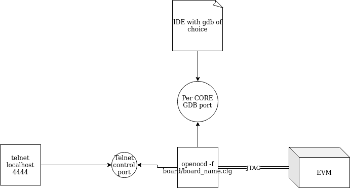
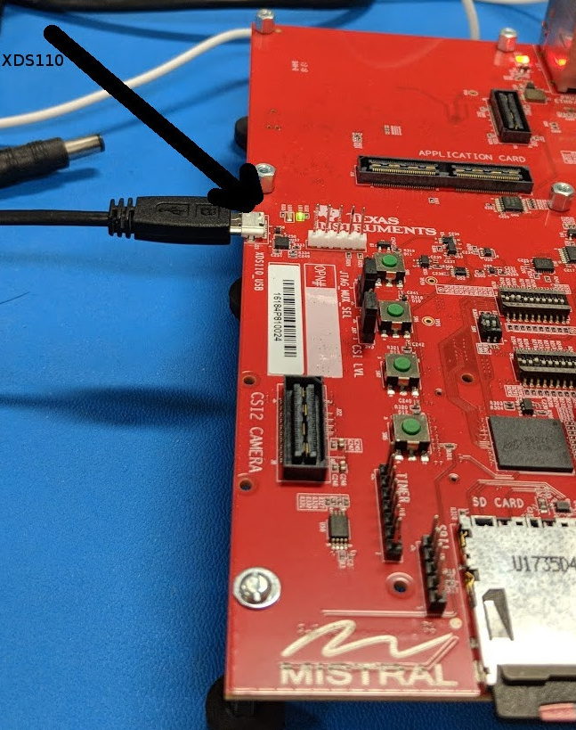
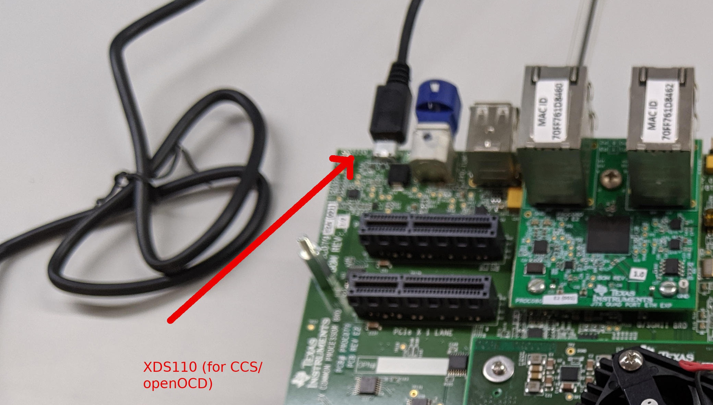
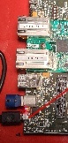
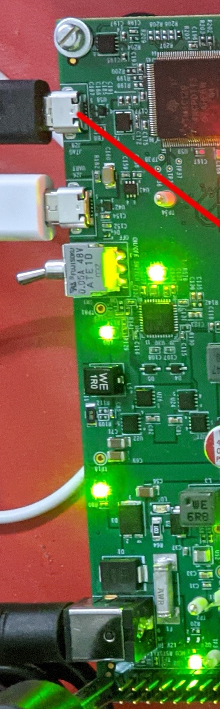

Quick Start
===========

[`docker pull nishanthmenon/openocd`](https://hub.docker.com/r/nishanthmenon/openocd/)

Motivation
==========

Yes - openOCD build and install is rather trivial. I could also alternatively host my
own tree and patches. However, I'd rather people be able to "get go" on a platform
with the openOCD being the least of their worries. Once the TI K3 patches get upstream,
this docker container may not exactly be of value.. but, might be easier to have some
basic startup scripts.

Startup Scripts
===============

You can use one of the following scripts depending on the TI K3 EVM in use:
* am642evm.sh
* am654evm.sh
* j7200evm.sh
* j721evm.sh

In addition for a new SoC, you could also use:
* discover.sh

Overall, openOCD usage looks like this:

OpenOCD Version
===============

v0.11.0-1-g4307d93eb00a

Connecting Hardware
===================

All of TI K3 EVM come with an embedded xds110 onboard, so getting JTAG is just a matter
of plugging in USB cable to the EVM. Few examples are below:

Maxwell EVM - AM654
===================

CFG file →  tcl/board/am6evm.cfg

Telnet commands
---------------

execute prior to connecting over GDB (since we do not know at any point
what cores might be operational)

|  **Command**        | **Function**
| ------------------- | ---------------------------------------------------------------------------------------------------
|  m3\_up             | Start debug of DMSC M3
|  mcu\_r5\_up 0      | MCU/Main R5 debug of core 0 in split mode or lockstep
|  mcu\_r5\_up 1      | MCU/Main R5 debug of core 1 in split mode
|  a53\_up 0  1 2 3   | A53 in individual debug of core  0 to core 4
|  a53\_smp           | A53s in SMP debug mode *http://openocd.org/doc/html/GDB-and-OpenOCD.html\#usingopenocdsmpwithgdb*

GDB ports:
----------

| **Port**   | **Function**
| ---------- | ------------------------------------
| 3333       | M3
| 3334       | A53 Core 0/SMP
| 3335       | A53 core 1
| 3336       | A53 core 2
| 3337       | A53 core 3
| 3338       | MCU R5 Core 0 (split/lockstep mode)
| 3339       | MCU R5 core 1 (split mode)

J721E Debug
==========

CFG file →  tcl/board/j721evm.cfg

Telnet commands
---------------

Since none of the cores can be guarenteed to be on any any time → run
openocd sudo ../src/openocd -f ./board/j721evm.cfg and telnet localhost
4444 → run one or all of the commands as needed for debug target.

Telnet commands to execute prior to connecting over GDB (since we do not
know at any point what cores might be operational)

| **Command**      | **Function**
| ---------------- | --------------------------------------------------------------------------------------------------
| m3\_up           | Start debug of DMSC M3
| mcu\_r5\_up 0    | MCU R5 debug of core 0 in split mode or lockstep
| mcu\_r5\_up 1    | MCU R5 debug of core 1 in split mode
| main0\_r5\_up 0  | Main0 R5 debug of core 0 in split mode or lockstep
| main0\_r5\_up 1  | Main0 R5 debug of core 1 in split mode
| main1\_r5\_up 0  | Main1 R5 debug of core 0 in split mode or lockstep
| main1\_r5\_up 1  | Main1 R5 debug of core 1 in split mode
| a72\_up 0  1     | A72 in individual debug of core  0 to core 4
| a72\_smp         | A72s in SMP debug mode *http://openocd.org/doc/html/GDB-and-OpenOCD.html\#usingopenocdsmpwithgdb*

GDB ports:
----------

| **Port**  | **Function**
| --------- | --------------------------------------
| 3333      | M3
| 3334      | A72 Core 0/SMP
| 3335      | A72 core 1
| 3336      | MCU R5 Core 0 (split/lockstep mode)
| 3337      | MCU R5 core 1 (split mode)
| 3338      | Main0 R5 Core 0 (split/lockstep mode)
| 3339      | Main0 R5 core 1 (split mode)
| 3340      | Main1 R5 Core 0 (split/lockstep mode)
| 3341      | Main1 R5 core 1 (split mode)

J7200 evm - J7VCL
=================

CFG file →  tcl/board/j7200evm.cfg

Telnet commands
---------------

Since none of the cores can be guarenteed to be on any any time → run
openocd sudo ../src/openocd -f ./board/j7200evm.cfg and telnet localhost
4444 → run one or all of the commands as needed for debug target.

Telnet commands to execute prior to connecting over GDB (since we do not
know at any point what cores might be operational)

| **Command**      |  **Function**
| ---------------- | --------------------------------------------------------------------------------------------------
| m3\_up           | Start debug of DMSC M3
| mcu\_r5\_up 0    | MCU R5 debug of core 0 in split mode or lockstep
| mcu\_r5\_up 1    | MCU R5 debug of core 1 in split mode
| main0\_r5\_up 0  | Main0 R5 debug of core 0 in split mode or lockstep
| main0\_r5\_up 1  | Main0 R5 debug of core 1 in split mode
| a72\_up 0  1     | A72 in individual debug of core  0 to core 4
| a72\_smp         | A72s in SMP debug mode *http://openocd.org/doc/html/GDB-and-OpenOCD.html\#usingopenocdsmpwithgdb*

GDB ports:
----------

| **Port**  | **Function**
| --------- | --------------------------------------
| 3333      | M3
| 3334      | A72 Core 0/SMP
| 3335      | A72 core 1
| 3336      | MCU R5 Core 0 (split/lockstep mode)
| 3337      | MCU R5 core 1 (split mode)
| 3338      | Main0 R5 Core 0 (split/lockstep mode)
| 3339      | Main0 R5 core 1 (split mode)

AM642 evm
=========

CFG file →  tcl/board/am642evm.cfg

Telnet commands
---------------

Since none of the cores can be guarenteed to be on any any time → run
openocd sudo ../src/openocd -f ./board/am642evm.cfg and telnet localhost
4444 → run one or all of the commands as needed for debug target.

Telnet commands to execute prior to connecting over GDB (since we do not
know at any point what cores might be operational)

| **Command**     | **Function**
| --------------- | --------------------------------------------------------------------------------------------------
| m3\_up          |  Start debug of DMSC M3
| main0\_r5\_up 0 |  Main0 R5 debug of core 0 in split mode or lockstep
| main0\_r5\_up 1 |  Main0 R5 debug of core 1 in split mode
| main1\_r5\_up 0 |  Main1 R5 debug of core 0 in split mode or lockstep
| main1\_r5\_up 1 |  Main1 R5 debug of core 1 in split mode
| a53\_up 0  1    |  A53 in individual debug of core  0 to core 4
| a53\_smp        |  A53s in SMP debug mode *http://openocd.org/doc/html/GDB-and-OpenOCD.html\#usingopenocdsmpwithgdb*
| m4\_up          |  Start debug of MCU M4

GDB ports:
----------

| **Port**  | **Function**
| --------- | --------------------------------------
| 3333      | M3
| 3334      | A53 Core 0/SMP
| 3335      | A53 core 1
| 3336      | Main0 R5 Core 0 (split/lockstep mode)
| 3337      | Main0 R5 core 1 (split mode)
| 3338      | Main1 R5 Core 0 (split/lockstep mode)
| 3339      | Main1 R5 core 1 (split mode)
| 3340      | MCU M4F

More reasonable GDB IDE/interfaces
==================================

Example Debug sessions:
-----------------------

(to M3):

Your browser does not support the HTML5 video element

*openocd-debug.mp4*

to A72 uboot:

Your browser does not support the HTML5 video element

*openocd-debug-uboot.mp4*

pure GDB:
---------

### gdb-dashboard:

*gdb-dash.webm*

*https://github.com/cyrus-and/gdb-dashboard*

wget -P \~ git.io/.gdbinit; mv \~/.gdbinit \~/.gdb-dashboard

arm-linux-gnueabihf-gdb --eval-command="target remote localhost:3333"
ti-sci-firmware-am65x-gp.elf

source \~/.gdb-dashboard

### gef:

*https://github.com/hugsy/gef*

### peda:

*https://github.com/longld/peda*

### pwndbg:

*https://github.com/pwndbg/pwndbg*

voltron:
--------

*https://github.com/snare/voltron*

DDD IDE:
--------

GDB (DDD startup):

 ddd --eval-command="target remote localhost:3333" --debugger
aarch64-linux-gnu-gdb /home/nmenon/Src/TI\_Prop/KS3/KS3FS/linux/vmlinux

Lauterbach IDE:
---------------

Config file:

\$ cat /tmp/t32.gdb

PBI=GDB

OS=

SCREEN=

FONT=SMALL

HEADER=TRACE32 For PowerView for ARMV8\[A53/A72..\] on GDB

OR

t32 -m gdb -7

or

t32 -m gdb -8

Pictures (using openocd and t32 as gdb interface):

U-boot A72

Linux A72:

All R5s in lockstep:

DMSC (SYSFW) M3:

VIM as IDE
----------

*https://windows-hexerror.linestarve.com/q/so47167589-Using-ConqueGDB-to-debug-ARM-microcontroller-with-OpenOCD*

Eclipse as IDE
--------------

*https://gnu-mcu-eclipse.github.io/debug/openocd/*

